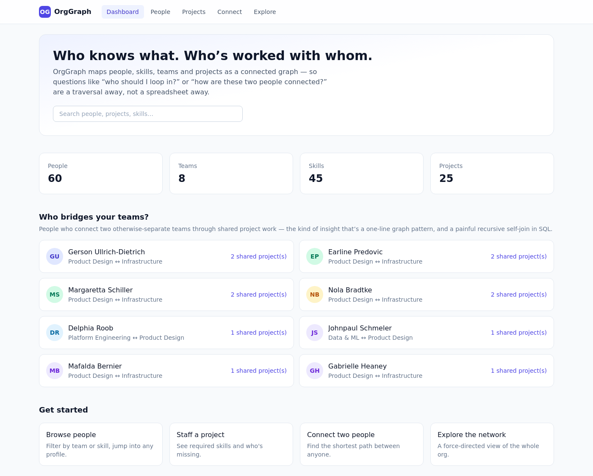
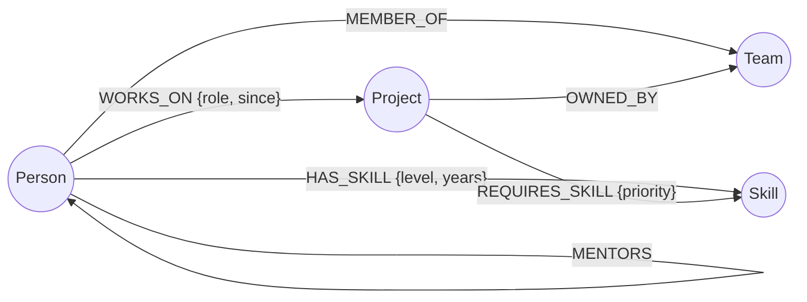
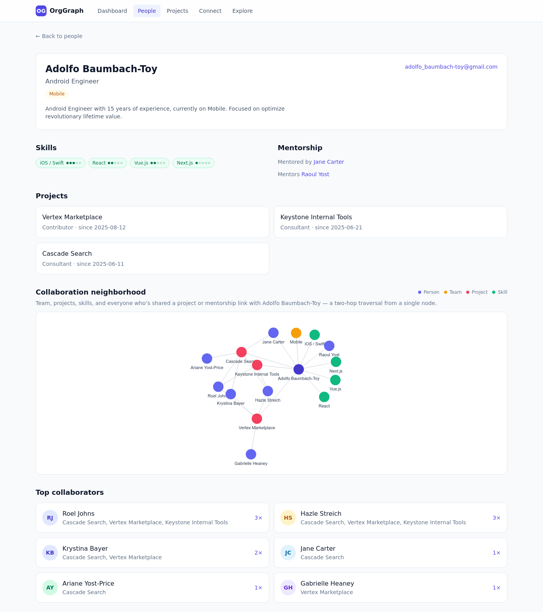
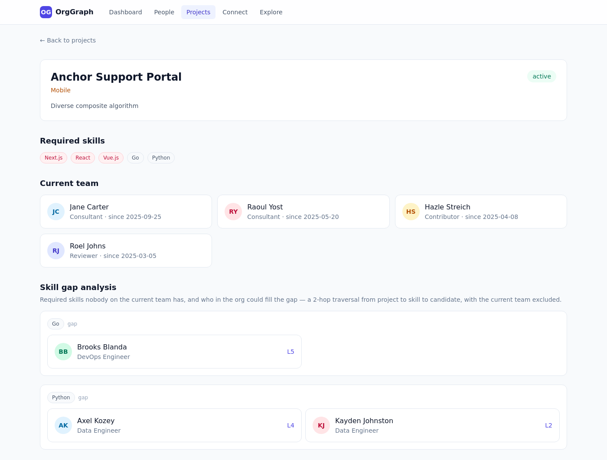
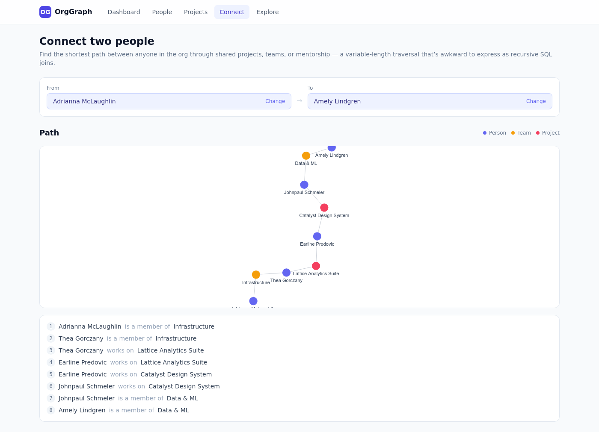
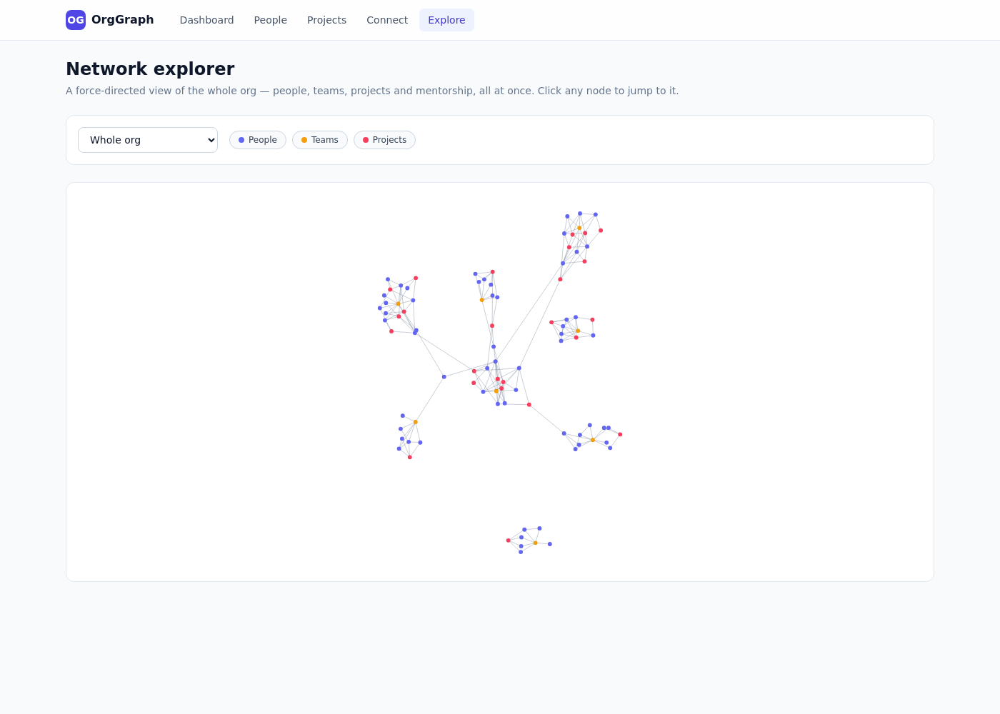

# OrgGraph

**A skills & collaboration network for an organization, built on [CognoDB Cloud](https://console.cognodb.com).**

OrgGraph maps people, skills, teams and projects as a connected graph, so questions that are genuinely about
*relationships* — "who should I loop in?", "how are these two people connected?", "who bridges these two teams?" —
are a graph traversal away instead of a pile of joins.

**Live demo:** [orggraph-wexa.vercel.app](https://orggraph-wexa.vercel.app)



---

## 1. The use case

Imagine an internal tool for a mid-size company: a directory of people, the skills they have, the teams they belong
to, and the projects they work on. Four questions make the case for a graph database better than any description:

1. **Staff a project.** Given a project's required skills, which ones does the current team actually lack, and who
   *else* in the org could fill that gap? (`/projects/[id]` → Skill gap analysis)
2. **Connect two people.** What's the shortest chain of shared projects, teams, or mentorship connecting any two
   people in the company? (`/connect`)
3. **Find the bridges.** Which people connect two otherwise-separate teams through shared project work — the
   informal glue holding cross-team collaboration together? (Dashboard → "Who bridges your teams?")
4. **Explore the network.** What does the whole org's collaboration structure look like as a graph? (`/explore`)

### Why a graph database?

Every one of those questions is a **traversal problem**, not a row-lookup problem:

- **Skill-gap analysis** is a 2-hop pattern (`Project → REQUIRES_SKILL → Skill ← HAS_SKILL ← Person`) with an
  exclusion (people already on the project). In SQL this is a join across three tables plus a `NOT EXISTS`
  correlated subquery — doable, but it stops being simple the moment you add "and rank candidates by skill level."
  In Cypher it's one `MATCH` clause.
- **"Connect two people"** needs a **variable-length shortest path** through a mix of relationship types
  (`WORKS_ON`, `MEMBER_OF`, `MENTORS`), where the number of hops isn't known in advance. Relational databases don't
  have a native operator for this — you'd reach for recursive CTEs, and the query plan degrades badly as the graph
  grows. Cypher has `shortestPath()` built in, and it's fast because the underlying storage follows pointers between
  records instead of matching on indexed foreign keys at every hop.
- **"Who bridges two teams"** is a self-join of `Person ⋈ Project ⋈ Person` filtered to people on different teams —
  in SQL that's already an awkward multi-way self-join, and doing it for *arbitrary* team pairs (not two hardcoded
  ones) makes it worse. In Cypher it's a single pattern match.
- The **schema itself** benefits from being a graph: relationships (`WORKS_ON`, `MENTORS`, `REQUIRES_SKILL`) are
  first-class, typed, and carry their own properties (role, since-date, skill level, priority) without needing a
  bridge table for every many-to-many relationship. Traversing from a person outward — team, skills, projects,
  collaborators, mentors — is the same operation regardless of how many hops it takes, which is exactly what "explore
  the network" needs.

None of this is *impossible* in a relational database. It's that the interesting queries here are all about
*connectedness*, and a graph database makes that the cheap, natural operation instead of the expensive, awkward one.

---

## 2. Data model



| Node | Properties |
|---|---|
| `Person` | `id`, `name`, `title`, `email`, `bio` |
| `Team` | `id`, `name` |
| `Skill` | `id`, `name`, `category` |
| `Project` | `id`, `name`, `description`, `status` |

| Relationship | Direction | Properties |
|---|---|---|
| `MEMBER_OF` | `Person → Team` | — |
| `HAS_SKILL` | `Person → Skill` | `level` (1-5), `years` |
| `WORKS_ON` | `Person → Project` | `role`, `since` |
| `MENTORS` | `Person → Person` | — |
| `REQUIRES_SKILL` | `Project → Skill` | `priority` (`must-have` / `nice-to-have`) |
| `OWNED_BY` | `Project → Team` | — |

**Deliberate design choice:** collaboration between two people is *not* stored as its own edge. It's derived at query
time from shared `WORKS_ON` edges to the same project. That's exactly the kind of relationship a relational schema
would need a bridge table and a self-join for — here it's a one-hop pattern from an existing edge.

The seed data (`scripts/seed-data.ts`) generates ~60 people across 8 teams, 45 skills in 9 categories, and 25
projects, and deliberately engineers a few cross-team "bridge" staffing assignments and a multi-hop mentorship chain
so the traversal-heavy features above return non-trivial results out of the box.

---

## 3. Setup

### 3.1 Create a CognoDB Cloud instance

1. Sign up at [console.cognodb.com/signup](https://console.cognodb.com/signup) (no credit card required).
2. From the console, create a free **c0** instance and pick a region — it provisions in under a minute.
3. Copy the connection URI (`bolt+s://<instance-id>.databases.cognodb.cloud`) and the generated password for the
   `cognodb` user. **The password is shown exactly once** — save it now.

### 3.2 Configure the app

```bash
cp .env.example .env.local
```

Fill in `.env.local`:

```
NEO4J_URI=bolt+s://<instance-id>.databases.cognodb.cloud
NEO4J_USERNAME=cognodb
NEO4J_PASSWORD=<your-generated-password>
```

`.env.local` is gitignored — never commit real credentials.

### 3.3 Install, seed, and run

```bash
npm install
npm run seed   # wipes and reloads the graph with fresh seed data (idempotent)
npm run dev    # http://localhost:3000
```

`npm run seed` connects with the official `neo4j-driver`, checks connectivity first, then loads all nodes and
relationships via parameterized, batched `UNWIND` writes (mindful of the free tier's 256 MB RAM / 0.5 vCPU limits —
the whole dataset is a few hundred nodes and under a thousand relationships).

---

## 4. The main queries

All queries live in [`src/lib/queries.ts`](src/lib/queries.ts) and run through a single parameterized `runRead` /
`runWrite` helper in [`src/lib/neo4j.ts`](src/lib/neo4j.ts) — **no string-concatenated Cypher anywhere**.

**Skill-gap analysis** — multi-hop traversal with exclusion (used on the project detail page):

```cypher
MATCH (pr:Project {id: $id})-[req:REQUIRES_SKILL]->(s:Skill)
OPTIONAL MATCH (pr)<-[:WORKS_ON]-(coveringPerson:Person)-[:HAS_SKILL]->(s)
WITH pr, s, req.priority AS priority, count(coveringPerson) AS coveredCount
WHERE coveredCount = 0
OPTIONAL MATCH (candidate:Person)-[hs:HAS_SKILL]->(s)
WHERE NOT (candidate)-[:WORKS_ON]->(pr)
WITH s, priority, candidate, hs
ORDER BY hs.level DESC
WITH s, priority, collect(CASE WHEN candidate IS NOT NULL THEN {
    id: candidate.id, name: candidate.name, title: candidate.title,
    email: candidate.email, bio: candidate.bio, level: hs.level, years: hs.years
  } END) AS allCandidates
RETURN s, priority, allCandidates[0..5] AS candidates
ORDER BY priority
```

**Shortest path between two people** — variable-length traversal across mixed relationship types (the query a
relational database finds genuinely awkward):

```cypher
MATCH (a:Person {id: $fromId}), (b:Person {id: $toId})
MATCH path = shortestPath((a)-[:WORKS_ON|MEMBER_OF|MENTORS*..10]-(b))
RETURN path
```

**Cross-team bridge people** — a pattern that would be a multi-way self-join in SQL:

```cypher
MATCH (p1:Person)-[:MEMBER_OF]->(t1:Team)
MATCH (p1)-[:WORKS_ON]->(proj:Project)<-[:WORKS_ON]-(p2:Person)-[:MEMBER_OF]->(t2:Team)
WHERE t1.id < t2.id
RETURN p1, t1, t2, count(DISTINCT proj) AS bridgeStrength
ORDER BY bridgeStrength DESC
LIMIT $limit
```

**Collaborator neighborhood** — 2-hop traversal powering the force-graph on a person's profile:

```cypher
MATCH (me:Person {id: $id})-[:WORKS_ON]->(proj:Project)<-[:WORKS_ON]-(collab:Person)
WHERE collab.id <> $id
RETURN collab, collect(DISTINCT proj.name) AS sharedProjects, count(DISTINCT proj) AS strength
ORDER BY strength DESC
```

> **A note on the target engine:** CognoDB's openCypher implementation doesn't support the newer `EXISTS { ... }`
> subquery syntax, and doesn't correctly evaluate multi-hop pattern predicates used as booleans (`WHERE NOT
> (a)-[:R1]-(:X)-[:R2]->(b)` silently returns `false` even for real matches — confirmed by testing the identical
> pattern as a `MATCH` clause). It also can't parse a list-slice applied directly to an aggregate call
> (`collect(...)[0..5]`) — binding the result to a variable first and slicing that works fine. All three are worked
> around above using `OPTIONAL MATCH` + `count()`, bare pattern predicates, and an extra `WITH` respectively.

---

## 5. Application

Next.js 14 (App Router, TypeScript), Tailwind CSS, `neo4j-driver` for CognoDB, `react-force-graph-2d` for
visualization, SWR for client-side data fetching with built-in loading/error state.

| Page | What it does |
|---|---|
| `/` | Org stats, search, and the "who bridges your teams?" insight |
| `/people`, `/people/[id]` | Directory (filter by team/skill) and profile with a force-graph neighborhood |
| `/projects`, `/projects/[id]` | Directory and detail page with the skill-gap analysis panel |
| `/connect` | Pick two people, see the shortest path visualized and spelled out step by step |
| `/explore` | Force-directed view of the whole org, filterable by team and node type |

Every page handles three states explicitly: **loading** (skeletons), **empty** (e.g. "fully staffed, no skill gaps"),
and **error** (the database is unreachable, with a retry button) — not just the happy path. Connection details are
read from environment variables only; `src/lib/neo4j.ts` wraps every query in a typed `DbUnavailableError` that API
routes turn into a 503 with a human-readable message instead of a stack trace.

### Screenshots

**Person profile — collaboration neighborhood**


**Project detail — skill gap analysis**


**Connect two people — shortest path**


**Network explorer**


---

## 6. Project structure

```
scripts/seed.ts, scripts/seed-data.ts   # seed data generation + parameterized batch load
src/lib/neo4j.ts                         # driver singleton, runRead/runWrite, connectivity check
src/lib/queries.ts                       # every Cypher query, parameterized, typed
src/lib/types.ts                         # shared domain + graph-viz types
src/app/                                 # pages (App Router) + API routes under app/api/*
src/components/                          # GraphView, PersonCard, SkillBadge, loading/empty/error states, ...
```

## 7. Engineering notes

- Every API route is `export const dynamic = "force-dynamic"` so the database is never touched at build time —
  `npm run build` succeeds even with no credentials configured.
- All Cypher is parameterized through `runRead`/`runWrite`; nothing is string-concatenated.
- The `neo4j-driver` instance is a single cached singleton (survives Next.js hot reload in dev), pooled with a max
  of 10 connections, well under CognoDB's free-tier 200 connection cap.
